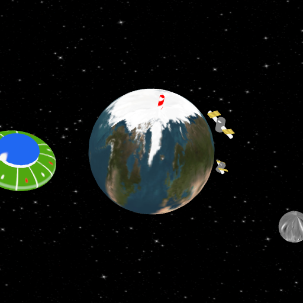

# Animation Project #2

#### ELEMENTS SUCCESSFULLY IMPLEMENTED:
1) At least one two-level hierarchical object: I Implemented multiple two-level hierarchical objects, the first are the 2 satellites, the satellite
    is made up of 4 pieces, the main body which is a cylinder, the arms which is also a cylinder that goes through the body, and finally
    the solar panels that are attached to each of the arms, the panels to rotate back and forth on the arms, although it is a little difficult to tell with
    all the other movement going on, the use a cosine*TIME equation to do this. The second Object worth noting for this part is the UFO, the UFO is made up of 3 pieces,
    but the body rotates independently of the windshield and connector piece of the ship.

2) I used all mapped textures, and every piece has its own unique textures that I got from [Wikimedia](https://commons.wikimedia.org/) The earth uses a modified version of [this](https://commons.wikimedia.org/wiki/File:Solarsystemscope_texture_2k_earth_daymap.jpg) image as the texture. The moon uses the following [texture](https://commons.wikimedia.org/wiki/File:14284-Moon-Maskelyne-LRO-20141012.jpg), and the solar panels on the satellite use a modified version of this [texture](https://commons.wikimedia.org/wiki/File:12Volt36CellSolarPanel2.jpg) (I removed some detail and changed the color to yellow/gold) All other textures used were created using GIMP.
These include the body of the satellite, the body and windshield of the UFO, the arms of the satellite and the North Pole sticking out of the earth, as well as the stars in the background.

3) SEE PARTIALLY IMPLEMENTED/NOT IMPLEMENTED SECTION
4) SEE PARTIALLY IMPLEMENTED/NOT IMPLEMENTED SECTION
5) SEE PARTIALLY IMPLEMENTED/NOT IMPLEMENTED SECTION

6) 360 Fly around camera is implemented in the render function, it uses sin and TIME variable to achieve the rotation, the rotation is set to last for 20 seconds(total duration of the animation).

7) Connection to real time is also implemented, I used the same approach as I did in Assignment #1.

8) The frame rate can be seen in the console output.

9) As far as complexity/creativity goes, I tried to create a scene that was complex enough that I would be able to use many textures, and animations to fill the scene. The scene design/story for the animation: I tried to convey our planet as seen from afar, and the satellites although there is only 2(felt like more would be too cluttered) are supposed to represent the thousands of satellites we have orbiting our planet (hence why they are so big in comparison), I also have the north pole as a rough reference of the axial rotation of the earth, and finally for fun I added a UFO flying across the scene to represent life outside our planet.

10) There is some motion control but it is a bit stubborn/buggy in terms of how much you can click/drag to rotate the scene. I tried to use textures that are high quality, to varying success (I think the mapping of the textures on the Earth could be better)

#### ELEMENTS PARTIALLY IMPLEMENTED/NOT IMPLEMENTED:
3/4/5) I was not able to design a shader from scratch and only used/modified the existing shader in the lab-5 base code.

## Playing the Animation

To view the animation simply open `main.html` in Chrome or Firefox.

